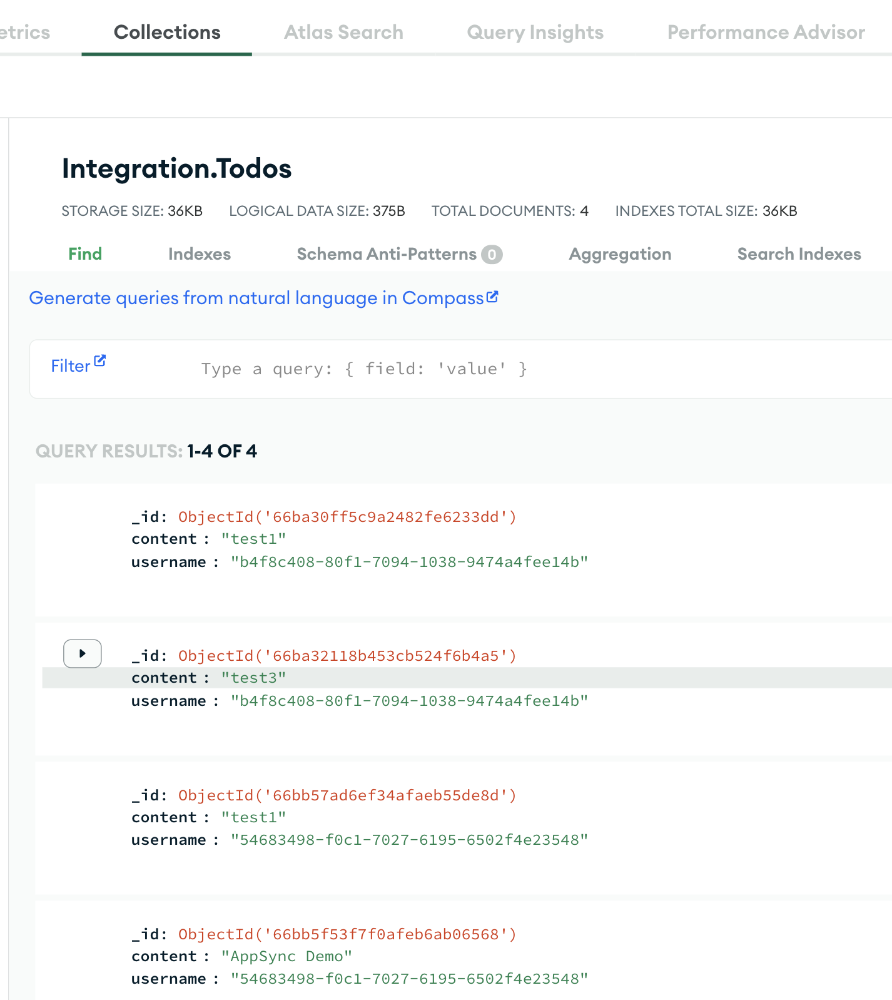

# Offline caching app with AWS Amplify, Tanstack, AppSync and MongoDB Atlas

This application demonstrates the offline caching capabilities of TanStack Query in conjunction with AWS Amplify, AWS AppSync, and MongoDB Atlas. By leveraging TanStack Query's caching mechanisms, the app ensures data availability even without an active network connection. AWS Amplify streamlines the development process, while AWS AppSync provides a robust GraphQL API layer, and MongoDB Atlas offers a scalable database solution. This integration showcases how TanStack Query's offline caching can be effectively utilized within a full-stack application architecture. 

## Target Architecture 


## Prerequisites

[MongoDB Atlas](https://www.mongodb.com/cloud/atlas/register)

[AWS Account](https://aws.amazon.com/free/)


## Features

- **Authentication**: Setup with Amazon Cognito for secure user authentication.
- **API**: Ready-to-use GraphQL endpoint with AWS AppSync.
- **Database**: Real-time database powered by MongoDB Atlas.
- **Tanstack Query**: Helps persist query data in storage, ensuring data availability even when the device is offline.


## Deploying to AWS

### Step 1

#### Set up the MongoDB Atlas cluster

Follow the [link](https://www.mongodb.com/docs/atlas/tutorial/create-atlas-account/) to the setup the [MongoDB Atlas cluster](https://www.mongodb.com/docs/atlas/tutorial/deploy-free-tier-cluster/), Database , [User](https://www.mongodb.com/docs/atlas/tutorial/create-mongodb-user-for-cluster/) and [Network access](https://www.mongodb.com/docs/atlas/security/add-ip-address-to-list/)


#### Set up the user

* [Configure User](https://www.mongodb.com/docs/atlas/security-add-mongodb-users/)

### Step 2

#### Clone the GitHub Repository

``` git clone https://github.com/mongodb-partners/amplify-mongodb-tanstack-offline```

### Step 3

#### Setup the AWS CLI credentials

```
export AWS_ACCESS_KEY_ID=
export AWS_SECRET_ACCESS_KEY=
export AWS_SESSION_TOKEN=
```

### Step 4

#### Deploy the To-do Application in AWS Amplify


Open the AWS Amplify console and Select the Github Option 


Configure the GitHub Repository


Select the GitHub Repository and click Next


Set all other options to default and deploy


### Step 5

#### Configure the Environment Variables

Configure the Environment variables after the successful deployment


### Step 6

#### open the application and test

Open the application through the URL provided and test the application.


MongoDB Atlas Output




### Troubleshoot

In the developer IDE we can create a sandbox environment to test the application code.

Configure the AWS CLI environment

```
export AWS_ACCESS_KEY_ID=
export AWS_SECRET_ACCESS_KEY=
export AWS_SESSION_TOKEN=
```

Set the enviornment variables for the following

```
export DB_NAME=
export COLLECTION_NAME=
export ATLAS_CONNECTION_STRING=

```

Build the Sandbox environment

`npx ampx sandbox`

Sample Output

 ``` 
 npx ampx sandbox                      
[Sandbox] Pattern !.vscode/extensions.json found in .gitignore. ".vscode/extensions.json" will not be watched if other patterns in .gitignore are excluding it.
  
  Amplify Sandbox
  
  Identifier:   babusrinivasan
  Stack:        amplify-amplifyvitereacttemplate-babusrinivasan-sandbox-db2189c06b
  
  To specify a different sandbox identifier, use --identifier
{"collection":"Todos","database":"Integration","dataSource":"Cluster0"}


✨  Synthesis time: 2.17s

⚠️ The --hotswap and --hotswap-fallback flags deliberately introduce CloudFormation drift to speed up deployments
⚠️ They should only be used for development - never use them for your production Stacks!

......
.....
```

On Successful build, open another shell and set the AWS Environment varibales

```
export AWS_ACCESS_KEY_ID=
export AWS_SECRET_ACCESS_KEY=
export AWS_SESSION_TOKEN=
```

Run the Application 

`npm run dev`

Sample Output:

```
  VITE v5.2.11  ready in 174 ms

  ➜  Local:   http://localhost:5173/
  ➜  Network: use --host to expose
  ➜  press h + enter to show help

  ```

Open the webpage on the localhost and test the application.


## Useful Link

For detailed instructions on deploying your application, refer to the [deployment section](https://docs.amplify.aws/react/start/quickstart/#deploy-a-fullstack-app-to-aws) of our documentation.


## Conclusion

In this repository, we've demonstrated how to integrate TanStack Query's offline caching capabilities with AWS Amplify, AWS AppSync, and MongoDB Atlas to build a robust, offline-first application. By leveraging the power of these technologies, developers, startups, and business consultants can quickly and efficiently build scalable and performant applications without worrying about network connectivity. With pre-configured authentication, API integration, and real-time database capabilities, this starter template simplifies the development process and reduces time to market. Whether you're a seasoned developer or just starting out, this repository is a valuable resource for jumpstarting your projects and leveraging the full potential of AWS services. Start building your next application today!